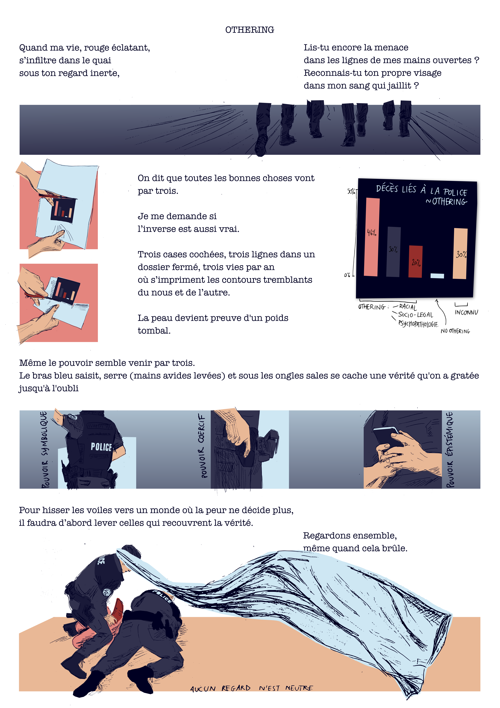

# Other comics
These are little comics I made to talk about what touches me deeply. (You can download the pngs of most of these in different languages.)

## Othering
On August 30, 2021, Roger Nzoy Wilhelm was killed by police at Morges train station. The investigation conducted by Border Forensics reveals how a man in distress could be perceived as a threat, how his body was transformed into a projection of the border between “us” and “the other.” His otherness led to the choice of lethal force rather than help and care.

In their reconstruction of police violence in Switzerland between 1992 and 2025, compiled in the Archive of Absence, researchers show how police-related deaths disproportionately affect people with at least one factor of othering. Through the various power structures of the police, the filtering of truth becomes possible, and justice for loved ones often remains out of reach.

My work is inspired by the Border Forensics report, in dialogue with research of Professor Magda Boutros. I hope to encourage a demand for transparency and invite you to be brave enough to face the truth.

Border Forensics. (2025). The death of Roger Nzoy Wilhelm. Retrieved November 4, 2025, from https://www.borderforensics.org/investigations/nzoy/

Translated with DeepL.com (free version)
## Another one breathes the dust
Created for an op-ed for [REVOLVE](https://revolve.media), inspired by [work at 6-t bureau d'étude](https://www.6-t.co/etudes/precarite-et-mobilite-automobile-dans-le-canton-de-geneve-indicateurs-cles-et-enjeux). In Geneva, wealthier residents travel long distances in large cars, mostly for leisure, generating the greatest share of emissions. By contrast, poorer households often drive older, more polluting vehicles, but their trips are short and tied to necessity. Despite contributing less overall, they are the ones most exposed to the noise, fumes, and fine particles of traffic.

## Summer Palimpsest
Written in summer in Geneva, overflowing with feelings and trying to go with the flow while everyone else seems to have their life figured out.

## When the pain takes over
Beauty helps me to overcome pain, written in 2024.

## al-Ard
Text written by the very talented Nataneh River, illustrated for Zine Solidaire Avec La Palestine.

## Line 3 replacement
Trying to amplify the voices of the Water Protectors opposing the replacement of the Line 3 pipeline.
https://www.npr.org/2021/06/17/1007805657/indigenous-activist-on-why-groups-are-protesting-the-line-3-pipeline-in-minnesot
https://www.giniw.org/reports-media/media

